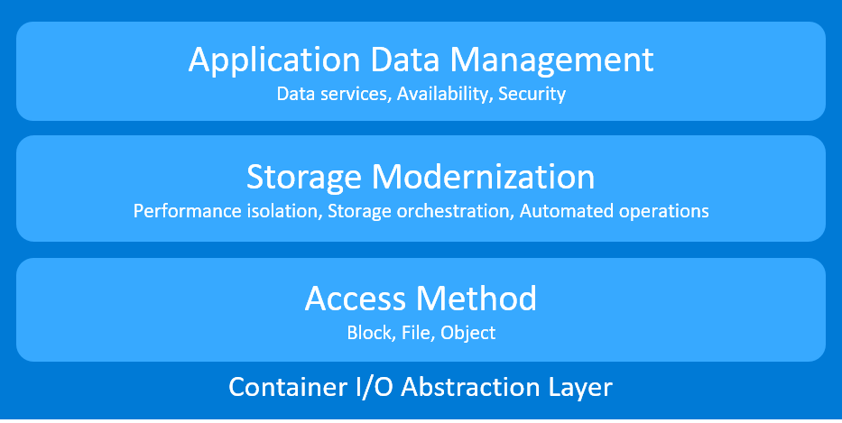

# Introduction 

Orchestration systems create an abstraction layer on top of a group of hosts, so development teams can quickly deploy applications on logical resources. Similarly, Storidge's Container I/O (CIO) is a tool that creates a storage abstraction layer for stateful applications to persist, share and manage data on logical resources. 

The CIO software runs on virtual machines, cloud instances and bare metal hosts. This means developers can easily create environments for stateful application development and testing that operates the same as production clusters. This flexibility helps eliminate "works on my machine" situations that slow development. 

## Why CIO?
Cloud native apps are orchestrated, scalable, mobile and storage agnostic. These traits make older storage technologies a poor fit. Storidge's CIO was purpose built to solve application data management challenges in these new orchestrated environments. It eliminates the manual effort, inconsistencies and tedium in trying to patch external networked storage into an orchestrated environment.

Modern applications are written to expect automated services from the environment so they can be singularly focused. These services provided by the orchestration system enable microservices development. Similarly, storage must be modernized to enable stateful applications running in orchestrated environments. Performance isolation should be an inherent capability that allows stateful apps to scale predictably. Storage orchestration and data locality must be baked in so rescheduled applications have consistent performance. Storage must be automated and delivered as a service with no operational involvement. 

For stateful applications, data management must happen at the granularity of the pod or container. High availability requires little or no operational setup when storage is implemented to work with schedulers. Data security should account for the fact that data is portable and access control locked to a local authentication server is a partial answer. 

This is the reason Storidge rearchitected a new solution for orchestrated environments. Built on a foundation for storage automation, CIO makes development teams more productive, and operations teams more efficient.

## CIO for Developers

- Use standard tools such as Vagrant and Terraform to spin up faster and consistently deploy environment for stateful application development

- Share so other team members can easily create their own development clusters with the same environment, dependencies and configuration

- Eliminate environment inconsistencies by using CIO to isolate dependencies on underlying infrastructure

- Work within your native development environment instead of spending time learning and coding to every cloud provider APIs

- Make CIO a component of your application stack so your apps always have automated storage-as-a-service available 

## CIO for Operations

- Make apps and data more portable, and reduce cloud lock-in by isolating dependencies on underlying infrastructure

- Save money by sharing and reusing the same tools, practices and experiences across different platforms

- Save time with storage that seamlessly supports orchestrated applications with consistent performance

- Bring development environment closer to production to shorten release cycles. Eliminate "works on my machine" problems and resolve issues earlier

- Avoid 3 am emergencies with automated storage operations and recovery

- Modernize storage with a purpose built solution for supporting both new and old applications

