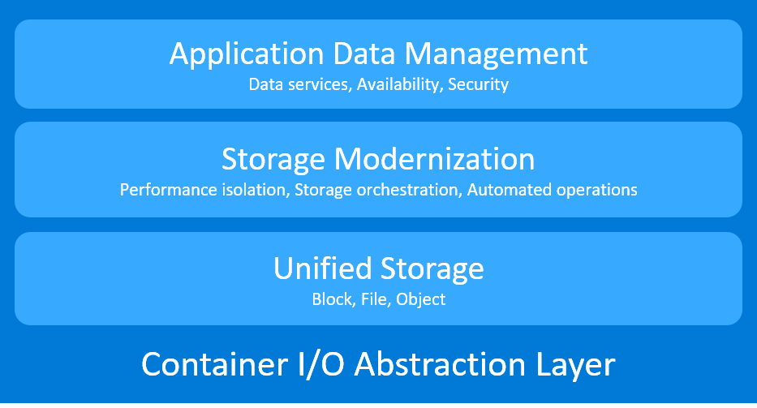

# Introduction 

Orchestration systems create an abstraction layer on top of a group of hosts, so development teams can quickly deploy applications on logical resources. Similarly, Storidge's Container I/O (CIO) is a tool that creates a storage abstraction layer for stateful applications to persist and share data on logical resources. 

The CIO software runs on virtual machines, cloud instances and bare metal hosts. This means developers can easily create environments for stateful application development and testing that operates the same as production clusters. This flexibility helps eliminate "works on my machine" situations that slow development. 

## Why CIO?
Cloud native apps are orchestrated, scalable, mobile and storage agnostic. These traits make older storage technologies a poor fit. Storidge's CIO was purpose built to solve data management challenges in these new orchestrated environments. It eliminates the manual effort, inconsistencies and tedium in trying to integrate external networked storage to an orchestrated environment. 

Built on a foundation for storage automation, the CIO software makes development teams more productive, and operations teams more efficient.

## CIO for Developers

- Use standard tools such as Vagrant and Terraform to spin up faster and consistently deploy environment for stateful application development

- Share so other team members can easily create their own development clusters with the same environment, dependencies and configuration

- Eliminate environment inconsistencies by using CIO to isolate dependencies on underlying infrastructure

- Work within your native development environment instead of spending time learning and coding to every cloud provider APIs

- Make CIO a component of your application stack so your apps always have automated storage-as-a-service available 

## CIO for Operations

- Make apps and data more portable, and reduce cloud lock-in by isolating dependencies on underlying infrastructure

- Save money by sharing and reusing the same tools, practices and experiences across different platforms

- Bring development environment closer to production to shorten release cycles, as problems are discovered and resolved earlier

- Avoid 3 am emergencies with storage that's automated for orchestration systems and backend storage operations

- Future proof investments with platform that supports legacy and cloud native application

